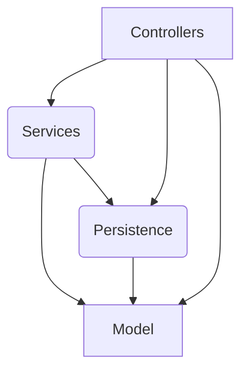

# Exercice 6 : Petit aperçu de ArchUnit

Le but est de te donner un minuscule aperçu de **ArchUnit**.

Il s'agit d'une librairie permettant de véfifier les règles d'architecture via des tests unitaires.

### 1. Lisez les bases de ArchUnit
- Allez sur https://www.archunit.org/

### 2. Créez un test vérifiant que les couches sont respectées sur ce projet
Voici les règles à respecter : 

**Rappel** : l'architecture de ce workshop est simpliste et n'est pas un modèle à recommander sur un projet.

- Inspirez vous de : https://github.com/TNG/ArchUnit-Examples/blob/master/example-junit5/src/test/java/com/tngtech/archunit/exampletest/junit5/LayeredArchitectureTest.java#L25
